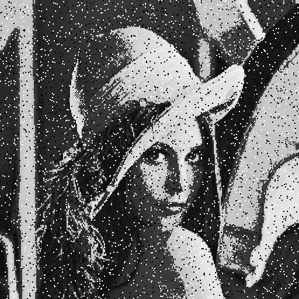

## Digital image processing
This file was generated out of a markdown file using pandoc and a slightly custom template.

### Homework 1

**Group P** including:

* Tom Nick - 340528
* Krzysztof Zielinski - 356965
* Yu Tian - 351021
* Jie Zou - 350830

#### Changes for the use of C++11
Because we wanted to use `C++11`, we added `set(CMAKE_CXX_FLAGS "${CMAKE_CXX_FLAGS} -std=c++11")` to the `CMakeCLists.txt`.

To to `Dip1.h` I added the below code to use lambdas.

```cpp
#include <functional>
using namespace std;
```

#### The real homework
All the processing we're doing is iterating over the columns/rows of the image, so I wrote a HOF called `forEachMat` doing just this. To process the image you're using `forEachMat` giving it the image, the x/y-stepsize and the process-function. The process-functions are given the image and the x/y coordinate and are using this information to manipulate the image.

```cpp
Mat Dip1::doSomethingThatMyTutorIsGonnaLike(Mat& img){
    
    Mat retImg;
    
    //converting to grayscale image
    cvtColor(img, retImg, CV_RGB2GRAY);

    // iterate over an openCV Mat and apply given function on every x/y step
    auto forEachMat = [](Mat img, int xstep, int ystep,
                         function<Mat (Mat img, int x, int y)> func) -> Mat {
        
        for (int x = 0; x < img.cols; x+=xstep) {
            for (int y = 0; y < img.rows; y+=ystep) {
                func(img, x, y);
            }
        }

        return img;
    };

    // densing the brightness distribution to the extremas
    // "bigger contrast"
    auto biggerContrast = [forEachMat](Mat img) -> Mat {
        
        auto process = [](Mat img, int x, int y) -> Mat {
            
            if (img.ptr<uchar>(x)[y] < 128) {
                img.ptr<uchar>(x)[y] = img.ptr<uchar>(x)[y]/2;
            } else {
                img.ptr<uchar>(x)[y] = img.ptr<uchar>(x)[y]/2 + 128;
            }

            return img;
        };

        return forEachMat(img, 1, 1, process);
    };

    // pixelation
    auto pixelate = [forEachMat](Mat img) -> Mat {
        
        auto process = [](Mat img, int x, int y) -> Mat {
            
            img.ptr<uchar>(x+1)[y] = img.ptr<uchar>(x)[y];
            img.ptr<uchar>(x)[y+1] = img.ptr<uchar>(x)[y];
            img.ptr<uchar>(x+1)[y+1] = img.ptr<uchar>(x)[y];

            return img;
        };

        return forEachMat(img, 2, 2, process);
    };

    // salt and pepper noise
    auto saltAndPepper = [forEachMat](Mat img) -> Mat {
        
        auto process = [](Mat img, int x, int y) -> Mat {
            
            if (rand() % 50 < 1) {
                if (rand() % 2) {
                    img.ptr<uchar>(x)[y] = 0;
                    img.ptr<uchar>(x+1)[y] = 0;
                    img.ptr<uchar>(x)[y+1] = 0;
                    img.ptr<uchar>(x+1)[y+1] = 0;
                } else {
                    img.ptr<uchar>(x)[y] = 255;
                    img.ptr<uchar>(x+1)[y] = 255;
                    img.ptr<uchar>(x)[y+1] = 255;
                    img.ptr<uchar>(x+1)[y+1] = 255;
                }
            }

            return img;
        };

        return forEachMat(img, 1, 1, process);
    };

    return saltAndPepper(pixelate(biggerContrast(retImg)));
}
```

#### Result


