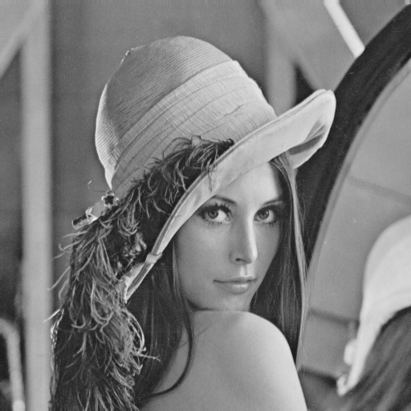
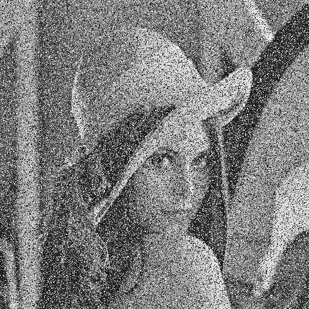
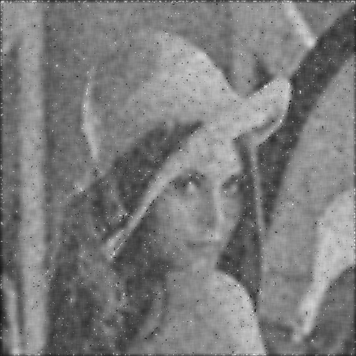
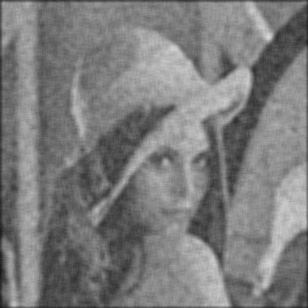
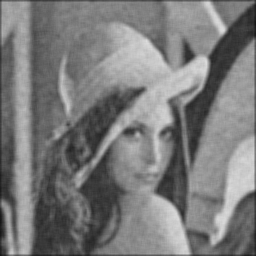
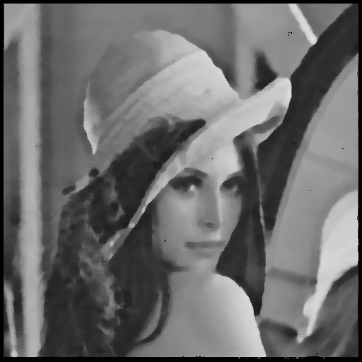

# Digital image processing
This file was generated out of a markdown file using pandoc and a slightly custom template.

## Homework 2

**Group P** including:

* Tom Nick - 340528
* Krzysztof Zielinski - 356965
* Yu Tian - 351021
* Jie Zou - 350830

### Changes for the use of C++11
Because we wanted to use `C++11`, we added `set(CMAKE_CXX_FLAGS "${CMAKE_CXX_FLAGS} -std=c++11")` to the `CMakeCLists.txt`.

To to `Dip2.h` I added the below code to use lambdas.

### Code part

```cpp
Mat Dip2::forEachMat(Mat& orig,
                     int xstep,
                     int ystep,
                     function<Mat (Mat orig, Mat copy, int x, int y)> func) {
    
  Mat copy = orig.clone();

  for (int x = 0; x < orig.cols; x += xstep) {
    for (int y = 0; y < orig.rows; y += ystep) {
      func(orig, copy, x, y);
    }
  }

  return copy;

};

// convolution in spatial domain
/*
src:     input image
kernel:  filter kernel
return:  convolution result
*/
Mat Dip2::spatialConvolution(Mat& src, Mat& kernel){
  
  auto convolution = [kernel](Mat orig, Mat copy, int x, int y) -> Mat {

    Mat defaultMat = Mat::ones(kernel.rows, kernel.cols, CV_32FC1);

    int center = kernel.rows/2;

    // border handling using default values
    for (int i = 0; i < kernel.rows; i++) {
      for (int j = 0; j < kernel.cols; j++) {
        if ((x + i) >= center && (x + i) < (orig.rows + center) &&
            (y + j) >= center && (y + j) < (orig.cols + center)) {
          defaultMat.at<float>(i, j) = orig.at<float>(x + i - center, y + j - center);
        }
      }
    }

    Mat flippedKernel;
    flip(kernel, flippedKernel, -1);

    float result = sum(defaultMat.dot(flippedKernel)).val[0];

    copy.at<float>(x, y) = result;

    return copy;

  };
  
  Mat copy = src.clone();

  Mat result = forEachMat(copy, 1, 1, convolution);

  return result;

}

// the average filter
// HINT: you might want to use Dip2::spatialConvolution(...) within this function
/*
src:     input image
kSize:   window size used by local average
return:  filtered image
*/
Mat Dip2::averageFilter(Mat& src, int kSize){

   Mat kernel = Mat(kSize, kSize, CV_32FC1, 1.0/(kSize * kSize));
   Mat copy = src.clone();
   Mat result = spatialConvolution(copy, kernel);

   return result;

}

// the adaptive filter
// HINT: you might want to use Dip2::averageFilter(...) within this function
/*
src:        input image
kSize:      window size used by local average
threshold:  threshold value on differences in order to decide which average to use
return:     filtered image
*/
Mat Dip2::adaptiveFilter(Mat& src, int kSize, double threshold){

   Mat average = averageFilter(src, kSize);
   Mat average3 = averageFilter(src, 3);

   auto adaptive = [threshold, average, average3](Mat orig, Mat copy, int x, int y) -> Mat {

    if (abs(average3.at<float>(x, y) - average.at<float>(x, y)) > threshold) {
      copy.at<float>(x, y) = average3.at<float>(x, y);
    } else {
      copy.at<float>(x, y) = average.at<float>(x, y);
    };

    return copy;
   
   };

   Mat result = forEachMat(average, 1, 1, adaptive);

   return result;

}

// the median filter
/*
src:     input image
kSize:   window size used by median operation
return:  filtered image
*/
Mat Dip2::medianFilter(Mat& src, int kSize){
  const clock_t begin_time = clock();
  Mat out(src.rows, src.cols, CV_32FC1);
  int k2=kSize*kSize;
  int array[k2];
  for(int y=kSize/2;y<src.cols-kSize/2;y++){
    for(int x=kSize/2;x<src.rows-kSize/2;x++){
      for(int k=0;k<k2;k++){
        array[k]=src.at<float>(y-1+k/kSize,x-1+k%kSize);
        std::sort(array, array+k2);
        out.at<float>(y,x)=array[k2/2];
      }
    }
  }
  std::cout << float( clock () - begin_time ) /  CLOCKS_PER_SEC;
  return out;
}
```

### Results
$\ \\ $
$\ \\ $
















$\ \\ $

### Theory-part

1. The moving average filter and the median filter are both simple methods of image smoothing. They are normally used to reduce noise in an image. The moving average filter performs well in reducing Gaussian Noise, while the median filter often does a better job of removing Shot Noise(salt and pepper noise) and preserving useful detail(edges) in the image.

2. The moving average filter is a linear filter, which is simply to replace each pixel value in an image with the average value of its neighbors. It will blur images and reduce noise as well as details. Since the shot noise pixel values are often very different from the surrounding values, they tend to significantly distort the pixel average calculated by the average filter. So we choose the median filter to remove shot noise. The median filter replaces each pixel value with the median of its neighbors. The median is a more robust average than the mean. So a single unrepresentative pixel in a neighborhood will not affect the median value significantly and the outliers can be removed effectively. What’s more, since the median value must actually be the value of one of the pixels in the neighborhood, the median filter does not create new unrealistic pixel values when the filter straddles an edge. For this reason the median filter is much better at preserving sharp edges than the average filter. In general, the median filter allows a great deal of high spatial frequency detail to pass while remaining very effective at removing noise on images where less than half of the pixels in a smoothing neighborhood have been effected. As a consequence of this, median filtering can be less effective at removing noise from images corrupted with Gaussian noise. That’s why the moving average filter is applied to dealing with Gaussian noise while the median filter is to Shot noise.

3. Gaussian smoothing filter

4. The moving average filter has two main problems, which are:
A single pixel with a very unrepresentative value can significantly affect the mean value of all the pixels in its neighborhood.
When the filter neighborhood straddles an edge, the filter will interpolate new values for pixels on the edge and so will blur that edge. This may be a problem if sharp edges are required in the output.
The Gaussian outputs a ‘weighted average’ of each pixel's neighborhood. The original pixel's value receives the heaviest weight and neighboring pixels receive smaller weights as their distance to the original pixel increases. This is in contrast to the mean filter's uniformly weighted average. Because of this, a Gaussian provides gentler smoothing and preserves edges better than a similarly sized mean filter.
