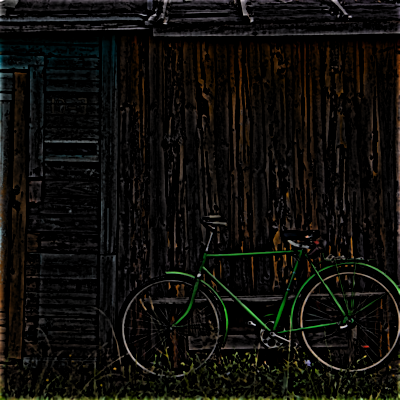
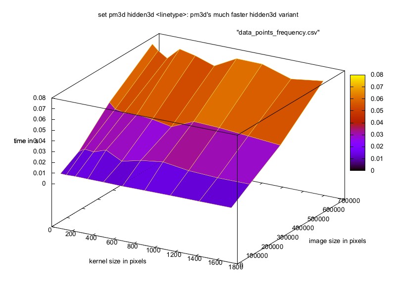
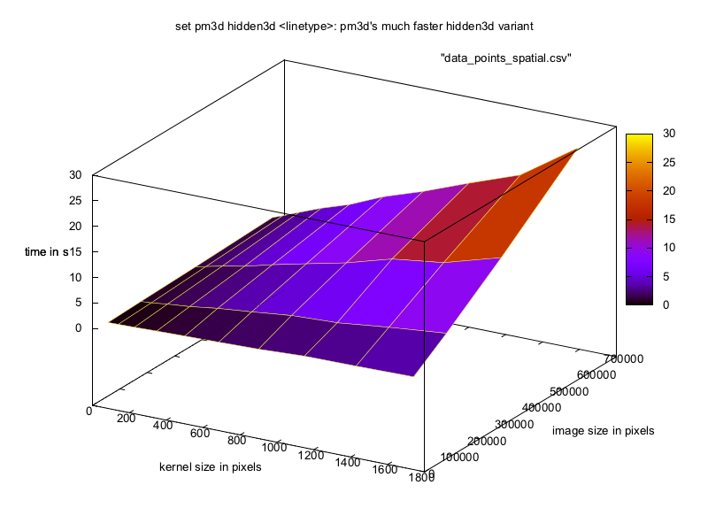

# Digital image processing
This file was generated out of a markdown file using gitprint.com.

## Homework 3

**Group P** including:

* Tom Nick - 340528
* Krzysztof Zielinski - 356965
* Yu Tian - 351021
* Jie Zou - 350830

### Changes for the use of C++11
Because we wanted to use `C++11`, we added `set(CMAKE_CXX_FLAGS "${CMAKE_CXX_FLAGS} -std=c++11")` to the `CMakeCLists.txt`.

### Exercices

#### create Gaussian Kernel

```cpp

Mat Dip3::createGaussianKernel(int kSize){
   
   float sigma = 0.3 * ((kSize - 1) * 0.5 - 1) + 0.8;
   int mean = kSize/2;
   Mat kernel = Mat::zeros(kSize, kSize, CV_32FC1);
   float sum = 0;

   for (int x = 0; x < kSize; x++) for (int y = 0; y < kSize; y++) {
      
      float scale = 1/(2 * M_PI * sigma * sigma);
      float e = -0.5 * (pow((x - mean)/sigma, 2.0) + pow((y - mean)/sigma, 2.0));
      float gaussXY =  scale * exp(e);

      sum += gaussXY;

      kernel.at<float>(x, y) = gaussXY;
   
   }

   // normalize kernel

   for (int x = 0; x < kSize; x++) for (int y = 0; y < kSize; y++) {
      kernel.at<float>(x, y) = (kernel.at<float>(x, y)/sum);
   }

   return kernel;
}

```

#### circShift
```cpp
Mat Dip3::circShift(Mat& in, int dx, int dy){

   // sanitze input
   
   dx = dx % in.cols;
   dy = dy % in.rows;

   Mat out = Mat::zeros(in.rows, in.cols, CV_32FC1);

   for (int x = 0; x < out.rows; x++) for (int y = 0; y < out.cols; y++) {
      
      int newX = (x + dx) % out.cols;
      int newY = (y + dy) % out.rows;
      
      newX = newX < 0 ? out.cols + newX : newX;
      newY = newY < 0 ? out.rows + newY : newY;
      out.at<float>(newX, newY) = in.at<float>(x, y);

   };

   return out;

}
```

#### Frequency Convolution
```cpp
Mat Dip3::frequencyConvolution(Mat& in, Mat& kernel){

   Mat tempA = Mat::zeros(in.rows, in.cols, CV_32FC1);
   Mat tempB = Mat::zeros(in.rows, in.cols, CV_32FC1);
   
   for (int x = 0; x < kernel.rows; x++) for (int y = 0; y < kernel.cols; y++) {
      tempB.at<float>(x, y) = kernel.at<float>(x, y);
   }
   
   tempB = circShift(tempB, -1, -1);

   dft(in, tempA, 0);
   dft(tempB, tempB, 0);
   mulSpectrums(tempA, tempB, tempB, 0);
   dft(tempB, tempA, DFT_INVERSE + DFT_SCALE);

   return tempA;
}
```

#### unsharp Masking
```cpp
Mat Dip3::usm(Mat& in, int type, int size, double thresh, double scale){

   // some temporary images 
   Mat tmp(in.rows, in.cols, CV_32FC1);
   
   // calculate edge enhancement

   // 1: smooth original image
   //    save result in tmp for subsequent usage
   switch(type){
      case 0:
         tmp = mySmooth(in, size, true);
         break;
      case 1:
         tmp = mySmooth(in, size, false);
         break;
      default:
         GaussianBlur(in, tmp, Size(floor(size/2)*2+1, floor(size/2)*2+1), size/5., size/5.);
   }

   subtract(in, tmp, tmp);

   for (int x = 0; x < in.rows; x++) for (int y = 0; y < in.cols; y++) {
      if (tmp.at<float>(x, y) > thresh) {
        in.at<float>(x, y) = in.at<float>(x, y) + tmp.at<float>(x, y) * scale;
      }
   }


   return in;

}
```

### Image results
Here are the examples with a size of 400x400 and a kernel-size of 17
#### created with spatial convolution



#### created frequency with frequency convolution


### Runtime

