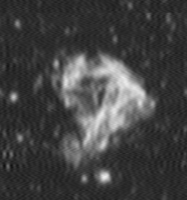

# Digital image processing
This file was generated out of a markdown file using gitprint.com.

## Homework 3

**Group P** including:

* Tom Nick - 340528
* Krzysztof Zielinski - 356965
* Yu Tian - 351021
* Jie Zou - 350830

### Changes for the use of C++11
Because we wanted to use `C++11`, we added `set(CMAKE_CXX_FLAGS "${CMAKE_CXX_FLAGS} -std=c++11")` to the `CMakeCLists.txt`.

### Exercices
The results of the filters do not look like that they are working correctly, I couldn't figure out why.





#### inverse filter

```cpp

// be sure not to touch them
  degraded = degraded.clone();
  filter = filter.clone();

  Mat tempA = Mat::zeros(degraded.size(), CV_32FC1);
  
  // convert to frequency spectrum
  Mat degradedFreq = degraded.clone();
  Mat filterFreq = Mat::zeros(degraded.size(), CV_32F);

  // add Border
  for (int x = 0; x < filter.rows; x++) for (int y = 0; y < filter.cols; y++) {
    filterFreq.at<float>(x, y) = filter.at<float>(x, y);
  }
   
  filterFreq = circShift(filterFreq, -1, -1);

  // transform to complex 
  Mat planes[] = {degradedFreq, Mat::zeros(degraded.size(), CV_32F)};
  Mat planesFilter[] = {filterFreq, Mat::zeros(filterFreq.size(), CV_32F)};
  
  merge(planes, 2, degradedFreq);
  merge(planesFilter, 2, filterFreq);

  dft(degradedFreq, degradedFreq, DFT_COMPLEX_OUTPUT); // degradedFreq == S
  dft(filterFreq, filterFreq, DFT_COMPLEX_OUTPUT); // filterFreq == P

  // create Q

  split(filterFreq, planes);

  Mat Re = planes[0];
  Mat Im = planes[1];
  
  // calculate Threshold
  double thresholdFactor = 0.5, threshold;
  double max = 0;

  Re.copyTo(tempA);
  abs(tempA);
  minMaxIdx(tempA, 0, &max, 0, 0, Mat());
  
  threshold = thresholdFactor * max;

  for (int x = 0; x < filterFreq.rows; x++) for (int y = 0; y < filterFreq.cols; y++) {

    if (Re.at<float>(x, y) >= threshold) {

      float resq = Re.at<float>(x, y) * Re.at<float>(x, y);
      float imsq = Im.at<float>(x, y) * Im.at<float>(x, y);

      // complex numbers need special attention

      Re.at<float>(x, y) = Re.at<float>(x, y) / (resq + imsq);
      Im.at<float>(x, y) = Im.at<float>(x, y) / (resq + imsq);

    } else {
      Re.at<float>(x, y) = 1/threshold;
      Im.at<float>(x, y) = 1/threshold;
    }

  }
  
  Mat Q = Mat::zeros(filterFreq.size(), CV_32F);
  
  merge(planes, 2, Q);

  Mat original;

  mulSpectrums(degradedFreq, Q, original, 1);
  dft(original, original, DFT_INVERSE + DFT_SCALE);
  split(original, planes);

  original = planes[0];

  if (original.channels() == 1) {
    normalize(original, original, 0, 255, CV_MINMAX);
    original.convertTo(original, CV_8UC1);
  } else {
    original.convertTo(original, CV_8UC3);
  }
 
  return original;
}

```

#### wiener filter

```cpp

Mat Dip4::wienerFilter(Mat& degraded, Mat& filter, double snr){

  // be sure not to touch them
  degraded = degraded.clone();
  filter = filter.clone();
   
  // Q_k = conjugate_transpose(P_k) / | P_k | ^2  + 1/SNR^2

  Mat filterFreq = filter.clone();
  Mat planesFilter[] = {filterFreq, Mat::zeros(filterFreq.size(), CV_32F)};
  merge(planesFilter, 2, filterFreq);
  
  dft(filterFreq, filterFreq, DFT_COMPLEX_OUTPUT); // filterFreq == P

  // create Q

  split(filterFreq, planesFilter);

  Mat Re = planesFilter[0];
  Mat Im = planesFilter[1];

  Mat QRe = Re.clone();
  Mat QIm = Im.clone();

  for (int x = 0; x < filterFreq.rows; x++) for (int y = 0; y < filterFreq.cols; y++) {

    // A*_ij = Ã_ji
    float reConjugateTranspose = filterFreq.at<float>(y, x);
    float imConjugateTranspose = -filterFreq.at<float>(y, x);
    float resq = Re.at<float>(x, y) * Re.at<float>(x, y);
    float imsq = Im.at<float>(x, y) * Im.at<float>(x, y);
    float ReAbs = Re.at<float>(x, y) / (resq + imsq);
    float ImAbs = Im.at<float>(x, y) / (resq + imsq);

    QRe.at<float>(x, y) = reConjugateTranspose / ((ReAbs * ReAbs) + 1/(snr * snr));
    QIm.at<float>(x, y) = imConjugateTranspose / ((ImAbs * ImAbs) + 1/(snr * snr));

  }
  
  Mat Q = Mat::zeros(filterFreq.size(), CV_32F);

  Mat qplanes[] = {QRe, QIm};
  
  merge(qplanes, 2, Q);

  Mat original;

  dft(Q, Q, DFT_INVERSE + DFT_SCALE);
  split(Q, planesFilter);
  Q = planesFilter[0];

  filter2D(degraded, original, -1, Q);

  if (original.channels() == 1) {
    normalize(original, original, 0, 255, CV_MINMAX);
    original.convertTo(original, CV_8UC1);
  } else {
    original.convertTo(original, CV_8UC3);
  }

  return original;

}

```

#### circShift
```cpp
Mat Dip3::circShift(Mat& in, int dx, int dy){

   // sanitze input
   
   dx = dx % in.cols;
   dy = dy % in.rows;

   Mat out = Mat::zeros(in.rows, in.cols, CV_32FC1);

   for (int x = 0; x < out.rows; x++) for (int y = 0; y < out.cols; y++) {
      
      int newX = (x + dx) % out.cols;
      int newY = (y + dy) % out.rows;
      
      newX = newX < 0 ? out.cols + newX : newX;
      newY = newY < 0 ? out.rows + newY : newY;
      out.at<float>(newX, newY) = in.at<float>(x, y);

   };

   return out;

}
```

