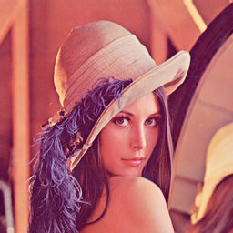
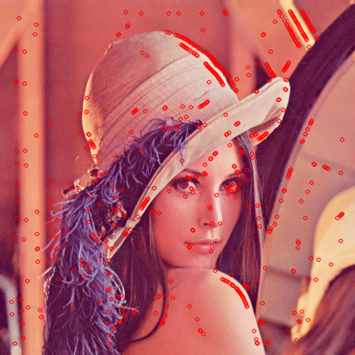

# Digital image processing
This file was generated out of a markdown file using gitprint.com.

## Homework 5

**Group P** including:

* Tom Nick - 340528
* Krzysztof Zielinski - 356965
* Yu Tian - 351021
* Jie Zou - 350830

### Changes for the use of C++11
Because we wanted to use `C++11`, we added `set(CMAKE_CXX_FLAGS "${CMAKE_CXX_FLAGS} -std=c++11")` to the `CMakeCLists.txt`.

### Exercises

```cpp
Mat Dip5::createFstDevKernel(double sigma){
  
  sigma = this->sigma;
  int kernelSize = (int) ceil(3 * sigma) + 1 - kernelSize % 2;
  Mat gaussianKernelX = getGaussianKernel(kernelSize,sigma, CV_32FC1);
  Mat gaussianKernelY = getGaussianKernel(kernelSize,sigma, CV_32FC1);
  Mat gaussianKernel = gaussianKernelX*gaussianKernelY.t();
  Mat fstKernel = Mat::ones(kernelSize, kernelSize, CV_32FC1);
  for (int x = 0; x < kernelSize; x++) for(int y = 0; y < kernelSize; y++) {
    int rx=x-kernelSize / 2;
    fstKernel.at<float>(x, y) =- rx * gaussianKernel.at<float>(x,y) / (sigma * sigma);
  }

  return fstKernel;
}

```

```
void Dip5::getInterestPoints(Mat& img, double sigma, vector<KeyPoint>& points) {
  int kernelSize = (int) (ceil(3 * sigma) + 1) - (kernelSize % 2);
  Mat fstdevKernelX =  createFstDevKernel(0);
  // cout << "fstKernel = "<< endl << " "  << fstdevKernelX << endl << endl;
  Mat fstdevKernelY =  fstdevKernelX.t();
  Mat gradientsX;
  filter2D(img, gradientsX, CV_32FC1, fstdevKernelX) ;
  // showImage(gradientsX, "asd", 1, true, false);
  Mat gradientsY;
  filter2D(img, gradientsY, CV_32FC1, fstdevKernelY) ;
  // showImage(gradientsY, "qwe", 0, true, false);
  Mat structureTensor = Mat::zeros(2,2,CV_32FC1);
  
  int i, j;
  Mat plesseyHarrisDetector = Mat::zeros(img.rows,img.cols,CV_32FC1);
  
  for (int x = kernelSize; x < img.rows - kernelSize; x++) for(int y=kernelSize;y(0, 0) += gradientsX.at<float>(i,j) * gradientsX.at<float>(i,j);
      structureTensor.at<float>(1, 1) += gradientsY.at<float>(i,j) * gradientsY.at<float>(i,j);
      structureTensor.at<float>(1, 0) += gradientsX.at<float>(i,j) * gradientsY.at<float>(i,j);
    }
    structureTensor.at<float>(0, 1) = structureTensor.at<float>(1, 0);
    float structureTensorTrace = sum(trace(structureTensor))[0];
    plesseyHarrisDetector.at<float>(x, y) = determinant(structureTensor) - 0.04 * structureTensorTrace * structureTensorTrace;
  }

  plesseyHarrisDetector = nonMaxSuppression(plesseyHarrisDetector);

  for(int x = kernelSize; x < img.rows - kernelSize; x++) for(int y = kernelSize; y < img.cols - kernelSize; y++) {
    if (abs(plesseyHarrisDetector.at<float>(x, y)) > 100000) {
      points.push_back(KeyPoint(y,x,5));
    }
  }
}
```

### result



