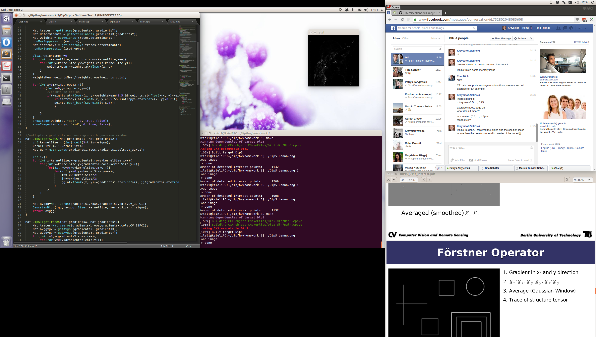
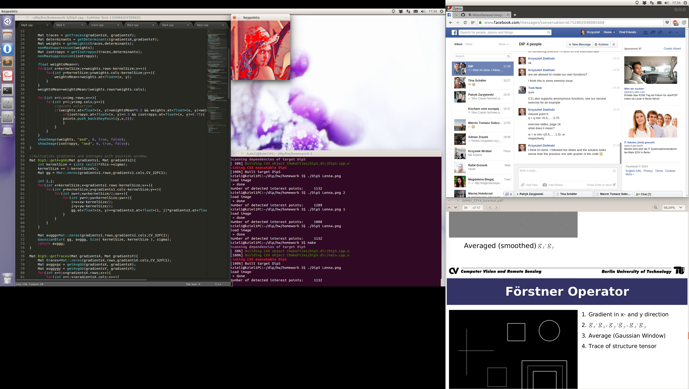
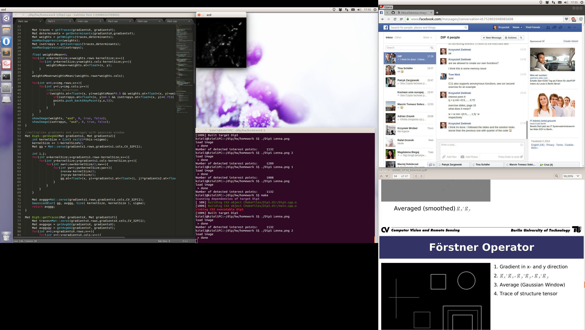
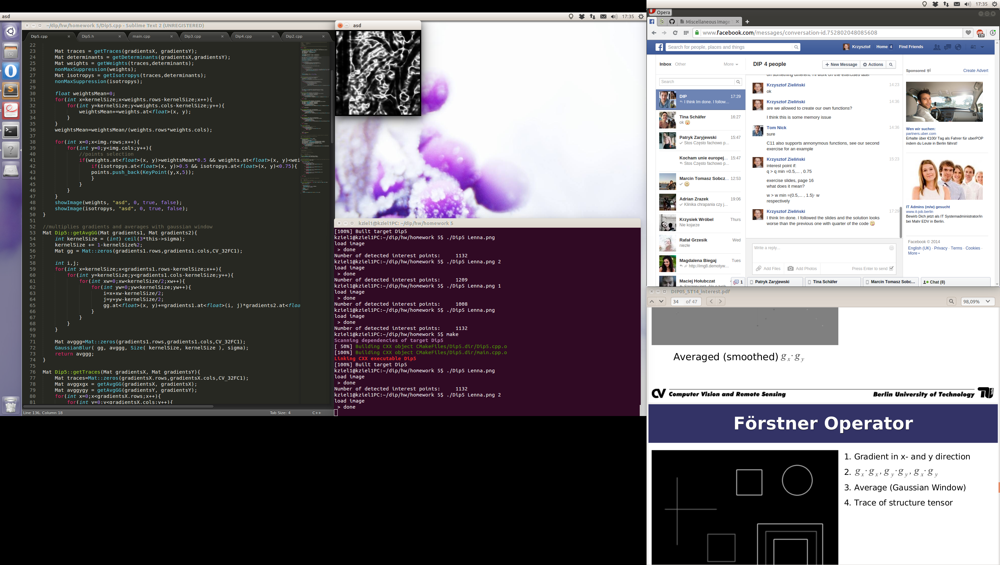

# Digital image processing
This file was generated out of a markdown file using gitprint.com.

## Homework 5

**Group P** including:

* Tom Nick - 340528
* Krzysztof Zielinski - 356965
* Yu Tian - 351021
* Jie Zou - 350830

### Changes for the use of C++11
Because we wanted to use `C++11`, we added `set(CMAKE_CXX_FLAGS "${CMAKE_CXX_FLAGS} -std=c++11")` to the `CMakeCLists.txt`.

### Exercises
```cpp
// uses structure tensor to define interest points (foerstner)
void Dip5::getInterestPoints(Mat& img, double sigma, vector<KeyPoint>& points){
	int kernelSize = (int) ceil(3*this->sigma);
	kernelSize += 1-kernelSize%2;
	Mat fstdevKernelX =  createFstDevKernel(0);
	Mat fstdevKernelY =  fstdevKernelX.t();
	Mat gradientsX;
	//applying gaussian gradient
	filter2D(img, gradientsX, CV_32FC1, fstdevKernelX) ;
	Mat gradientsY;
	filter2D(img, gradientsY, CV_32FC1, fstdevKernelY) ;

	Mat traces = getTraces(gradientsX, gradientsY);
	Mat determinants = getDeterminants(gradientsX,gradientsY);
	Mat weights = getWeights(traces,determinants);
	nonMaxSuppression(weights);
	Mat isotropys = getIsotropys(traces,determinants);
	nonMaxSuppression(isotropys);

	float weightsMean=0;
	for(int x=kernelSize;x<weights.rows-kernelSize;x++){
  		for(int y=kernelSize;y<weights.cols-kernelSize;y++){
  			weightsMean+=weights.at<float>(x, y);
  		}
  	}
	weightsMean=weightsMean/(weights.rows*weights.cols);

	for(int x=0;x(x, y)>weightsMean*0.5 && weights.at<float>(x, y)<weightsMean*1.5){
  				if(isotropys.at<float>(x, y)>0.5 && isotropys.at<float>(x, y)<0.75){
  				points.push_back(KeyPoint(y,x,5));
  				}
  			}
  		}
	}
	showImage(weights, "asd", 0, true, false);
	showImage(isotropys, "asd", 0, true, false);
}

//multiplies gradients and averages with gaussian window
Mat Dip5::getAvgGG(Mat gradients1, Mat gradients2){
	int kernelSize = (int) ceil(3*this->sigma);
	kernelSize += 1-kernelSize%2;
	Mat gg = Mat::zeros(gradients1.rows,gradients1.cols,CV_32FC1);

	int i,j;
	for(int x=kernelSize;x<gradients1.rows-kernelSize;x++){
  		for(int y=kernelSize;y<gradients1.cols-kernelSize;y++){
  			for(int xw=0;xw<kernelSize/2;xw++){
 				for(int yw=0;yw<kernelSize;yw++){
					i=x+xw-kernelSize/2;
 					j=y+yw-kernelSize/2;
					gg.at<float>(x, y)+=gradients1.at<float>(i, j)*gradients2.at<float>(i, j);
  				}
  			}
  		}
  	}

	Mat avggg=Mat::zeros(gradients1.rows,gradients1.cols,CV_32FC1);
	GaussianBlur( gg, avggg, Size( kernelSize, kernelSize ), sigma);
	return avggg;
}

Mat Dip5::getTraces(Mat gradientsX, Mat gradientsY){
	Mat traces=Mat::zeros(gradientsX.rows,gradientsX.cols,CV_32FC1);
	Mat avggxgx = getAvgGG(gradientsX, gradientsX);
	Mat avggygy = getAvgGG(gradientsY, gradientsY);
	for(int x=0;x<gradientsX.rows;x++){
  		for(int y=0;y<gradientsX.cols;y++){
			traces.at<float>(x, y)=avggxgx.at<float>(x, y)+avggygy.at<float>(x, y);
		}
  	}
	return traces;
}

Mat Dip5::getDeterminants(Mat gradientsX, Mat gradientsY){
	Mat determinants=Mat::zeros(gradientsX.rows,gradientsX.cols,CV_32FC1);
	Mat avggxgx = getAvgGG(gradientsX, gradientsX);
	Mat avggygy = getAvgGG(gradientsY, gradientsY);
	Mat avggxgy = getAvgGG(gradientsX, gradientsY);
	for(int x=0;x<gradientsX.rows;x++){
  		for(int y=0;y<gradientsX.cols;y++){
			determinants.at<float>(x, y)=avggxgx.at<float>(x, y)*avggygy.at<float>(x, y)-avggxgy.at<float>(x, y)*avggxgy.at<float>(x, y);
		}
  	}
	return determinants;
}

Mat Dip5::getWeights(Mat traces, Mat determinants){
	Mat weights=Mat::zeros(traces.rows,traces.cols,CV_32FC1);
	for(int x=0;x<traces.rows;x++){
  		for(int y=0;y<traces.cols;y++){
  			if(traces.at<float>(x,y)!=0){
			weights.at<float>(x, y)=determinants.at<float>(x,y)/traces.at<float>(x,y);
			}
		}
  	}
	return weights;
}

Mat Dip5::getIsotropys(Mat traces, Mat determinants){
	Mat isotropys=Mat::zeros(traces.rows,traces.cols,CV_32FC1);
	for(int x=0;x<traces.rows;x++){
  		for(int y=0;y<traces.cols;y++){
  			if(traces.at<float>(x,y)!=0){
			isotropys.at<float>(x, y)=4*determinants.at<float>(x,y)/(traces.at<float>(x,y)*traces.at<float>(x,y));
			}
		}
  	}
	return isotropys;
}

bool Dip5::hasNaN(Mat mat){
	//debug function to find dividing by zero
	for(int x=0;x<mat.rows;x++){
  		for(int y=0;y<mat.cols;y++){
  			if(mat.at<float>(x, y) != mat.at<float>(x, y)){
  				cout << "hasNaN";
  				return true;
  			}
  		}
  	}
  	cout << "NOThasNaN";
  	return false;
}

// creates kernel representing fst derivative of a Gaussian kernel in x-direction
/*
sigma	standard deviation of the Gaussian kernel
return	the calculated kernel
*/
Mat Dip5::createFstDevKernel(double sigma){
	sigma=this->sigma;
	int kernelSize = (int) ceil(3*this->sigma);
	kernelSize += 1-kernelSize%2;
	Mat gaussianKernelX = getGaussianKernel(kernelSize,sigma, CV_32FC1);
	Mat gaussianKernelY = getGaussianKernel(kernelSize,sigma, CV_32FC1);
	Mat gaussianKernel = gaussianKernelX*gaussianKernelY.t();
	Mat fstKernel = Mat::ones(kernelSize, kernelSize, CV_32FC1);
 	for(int x=0;x<kernelSize;x++){
 		for(int y=0;y<kernelSize;y++){
 			int rx=x-kernelSize/2;
 			fstKernel.at<float>(x, y)=-rx*gaussianKernel.at<float>(x,y)/sigma/sigma;
 		}
 	}
	return fstKernel;
}
```

### original

### sigma 0.5 [weights isotropy keypoints]



### sigma 2 [weights isotropy keypoints]



